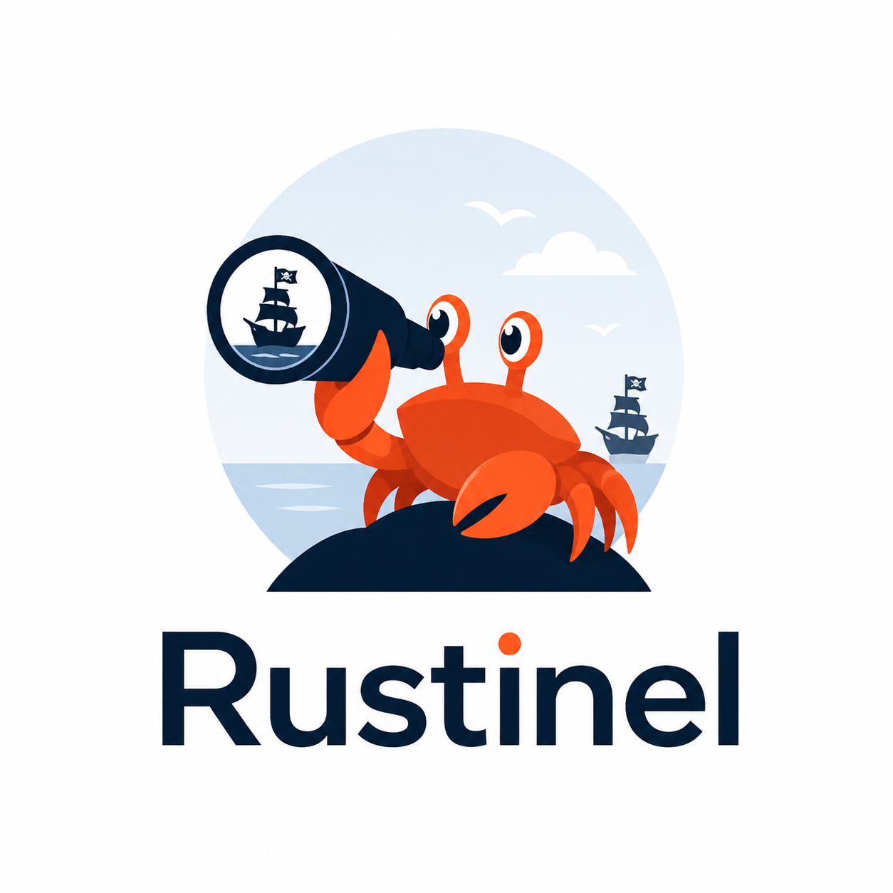

<p align="center">
  
</p>

<h1 align="center">rustinel-rules</h1>

<p align="center">
  <b>Detection packs for Rustinel.</b><br>
  Curated Sigma and YARA detections for Windows, Linux, and macOS.
</p>

<p align="center">
  <a href="https://github.com/Karib0u/rustinel-rules/actions/workflows/validate.yml"></a>
  <a href="https://github.com/Karib0u/rustinel-rules/releases/latest"></a>
  <a href="LICENSE"></a>
</p>

<p align="center">
  <a href="https://github.com/Karib0u/rustinel-rules/releases/latest">Download packs</a> |
  <a href="https://docs.rustinel.io/rule-packs/">Documentation</a> |
  <a href="https://github.com/Karib0u/rustinel">Rustinel engine</a> |
  <a href="https://rustinel.io/">Website</a>
</p>

## Quickstart

[Install Rustinel](https://docs.rustinel.io/installation/), then choose a pack for your platform:

```bash
rustinel rules list
sudo rustinel rules install linux-essential
sudo rustinel service restart
```

Replace `linux-essential` with a pack ID for your platform.
On Windows, use `windows-essential` and run the commands in an elevated PowerShell without `sudo`.
`rustinel setup` installs the Essential pack for you.
See [Manage rule packs](https://docs.rustinel.io/rule-packs/) for updates and manual installation.

## Packs

| Level | Use | Platforms |
| --- | --- | --- |
| Essential | High-confidence detections with low expected noise. Start here. | Windows, Linux, macOS |
| Advanced | Broader coverage, with more environment-dependent false positives. | Windows, Linux, macOS |
| Hunting | Noisier leads for investigation. | Windows |

Packs are cumulative: Advanced includes Essential, and Hunting includes Advanced.
Install one pack per endpoint.
macOS packs are experimental.
The tooling also supports typed IOC sets; current packs contain no IOC indicators.

Content is versioned independently from the engine.
Each pack declares its minimum Rustinel version, and the updater checks compatibility before installing it.
See [pack manifests](packs/) for membership and [releases](https://github.com/Karib0u/rustinel-rules/releases) for changes.

## Contribute

Each detection lives once in `rules/`; packs reference it by its stable ID.
New detections should map to ATT&CK, use supported telemetry, and include a reproducible test where possible.

```bash
uv sync --frozen
uv run python tools/validate.py
uv run python tools/build_packs.py
```

[Contributing](CONTRIBUTING.md) | [Write and test rules](https://docs.rustinel.io/rule-development/) | [Issues](https://github.com/Karib0u/rustinel-rules/issues)

## License

[Detection Rule License 1.1](LICENSE).
